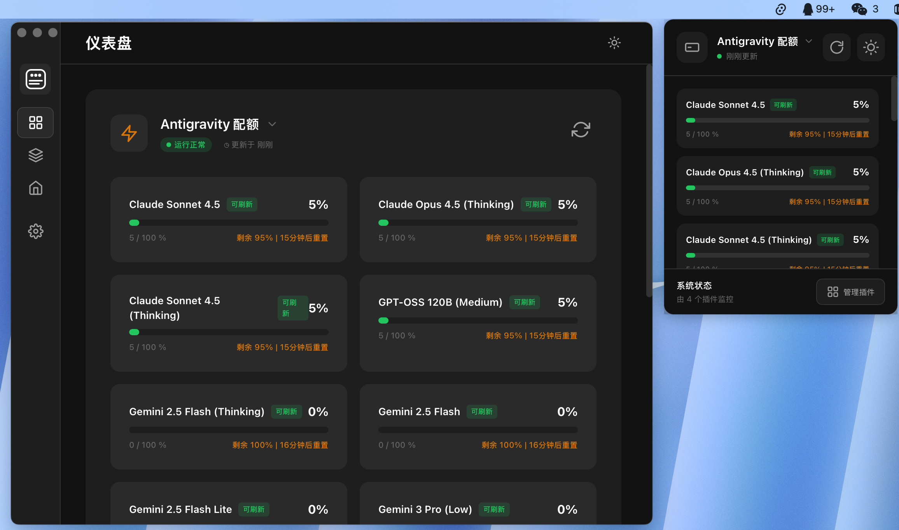
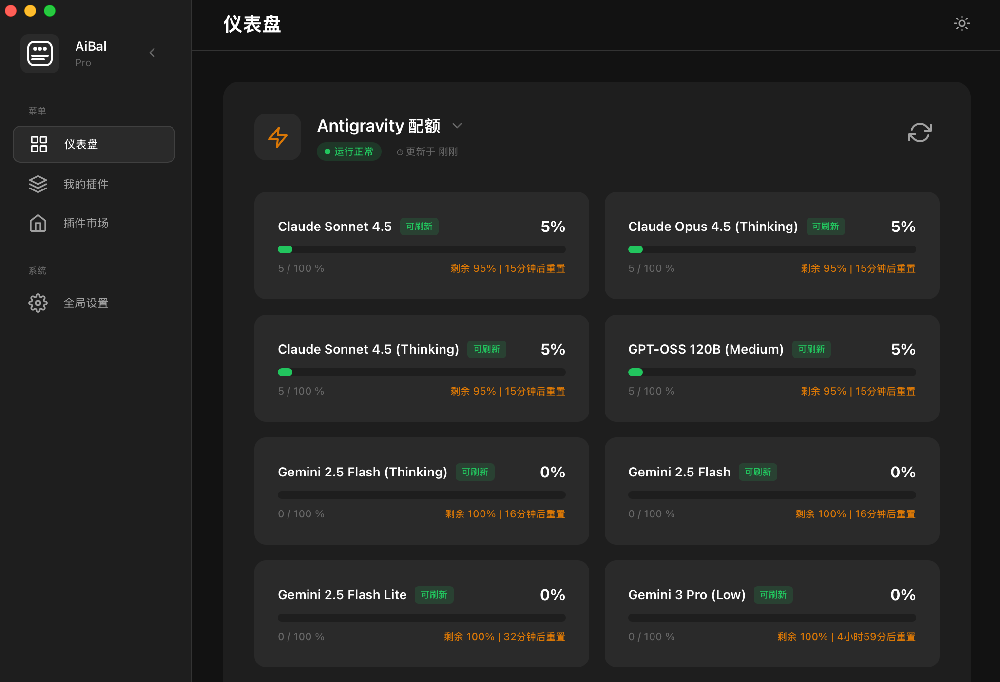
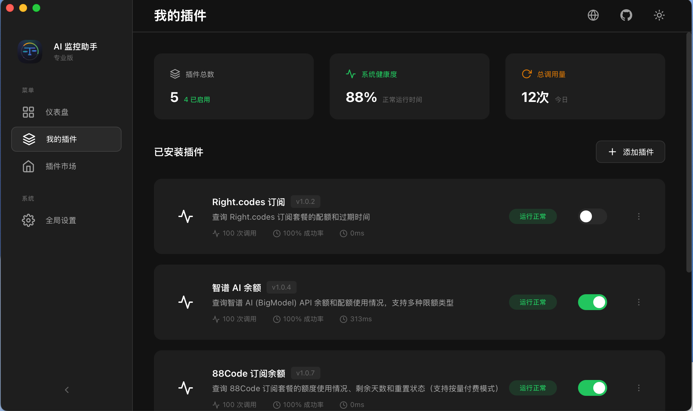
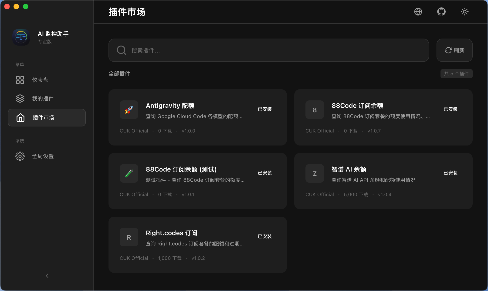

# AiBal

<p align="center">
  
</p>

<p align="center">
  <strong>macOS 菜单栏 AI 用量追踪器</strong>
</p>

<p align="center">
  一站式追踪多个 AI 服务商的 API 用量、配额和余额
</p>

<p align="center">
  <a href="README.md">English</a> | 简体中文
</p>

---

## 预览

<p align="center">
  
</p>

## 功能特性

- **多服务商支持** - 同时追踪 Claude、GPT、Gemini 等多个 AI 服务
- **实时监控** - 一目了然查看配额消耗和剩余额度
- **菜单栏集成** - 从 macOS 菜单栏快速访问
- **插件系统** - 通过社区插件扩展功能
- **插件市场** - 轻松发现和安装插件
- **深色模式** - 原生深色主题 UI

## 截图展示

### 仪表盘
在统一的仪表盘中监控所有 AI 模型的配额使用情况。

<p align="center">
  
</p>

### 插件管理
一键启用/禁用已安装的插件。

<p align="center">
  
</p>

### 插件市场
浏览并安装社区插件。

<p align="center">
  
</p>

## 安装

### 下载安装包

从 [Releases](https://github.com/DDG0808/aibal/releases) 下载最新的 `.dmg` 文件。

### 从源码构建

#### 环境要求

| 依赖 | 版本要求 |
|------|----------|
| macOS | 10.15+ (Catalina 及以上) |
| Node.js | 18+ |
| pnpm | 8+ |
| Rust | 1.77+ |
| Xcode CLI | 必需 |

#### 构建步骤

```bash
# 克隆仓库
git clone https://github.com/DDG0808/aibal.git
cd aibal

# 安装依赖
pnpm install

# 开发模式运行
pnpm tauri dev

# 生产构建
pnpm tauri build
```

## 技术栈

### 前端
- Vue 3 + Composition API
- Pinia (状态管理)
- Vue Router
- Vite
- TypeScript

### 后端
- Tauri 2.x
- Rust
- QuickJS (插件运行时)
- Tokio (异步运行时)

## 项目结构

```
aibal/
├── src/                    # 前端代码 (Vue 3 + TypeScript)
│   ├── components/         # UI 组件
│   ├── views/              # 页面视图
│   ├── stores/             # Pinia 状态管理
│   ├── services/           # 服务层
│   └── types/              # 类型定义
│
├── src-tauri/              # 后端代码 (Rust)
│   ├── src/
│   │   ├── commands/       # Tauri IPC 命令
│   │   ├── plugin/         # 插件系统
│   │   └── tray/           # 系统托盘
│   └── tauri.conf.json     # Tauri 配置
│
└── contracts/              # 插件 API 契约
    └── types/              # TypeScript 类型定义
```

## 插件开发

AiBal 支持插件系统，允许你添加自定义的 AI 服务商集成。

插件是运行在沙箱化 QuickJS 环境中的 JavaScript 模块，具有受控的 API 访问权限。

详见 [插件开发指南](https://github.com/DDG0808/aibal/wiki/Plugin-Development)。

## 参与贡献

欢迎贡献代码！请随时提交 Pull Request。

## 开源许可

[MIT](LICENSE)

## 致谢

基于 [Tauri](https://tauri.app/) 和 [Vue.js](https://vuejs.org/) 构建。
